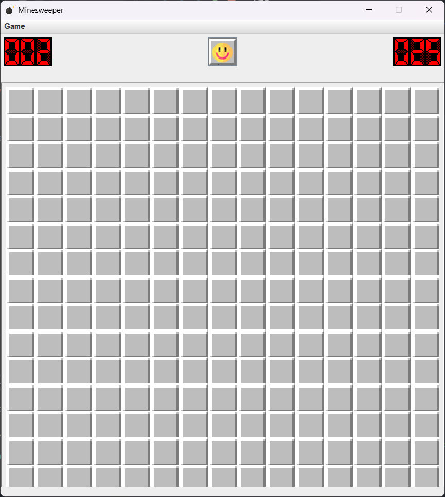
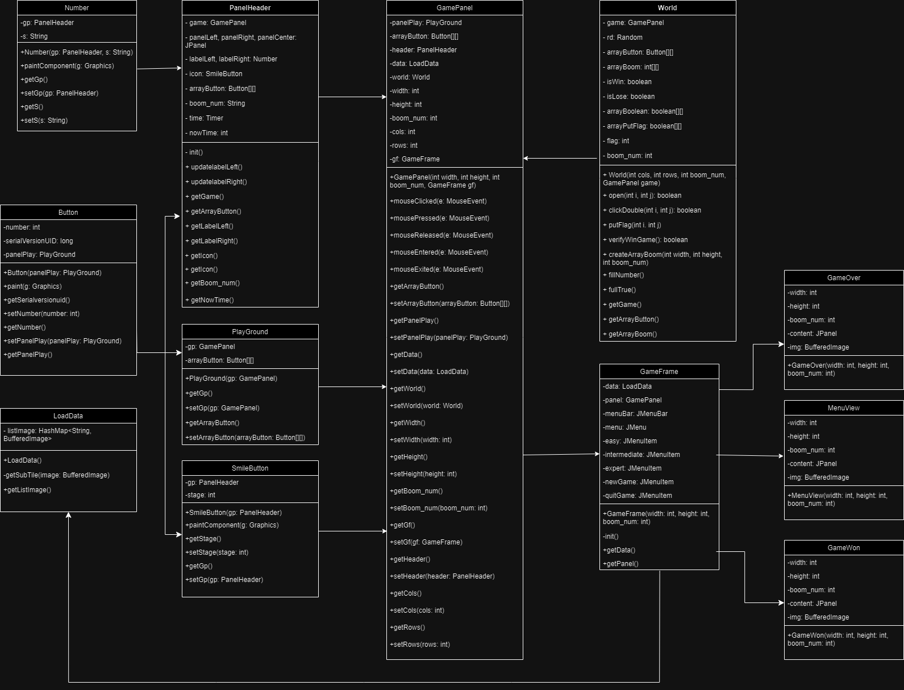
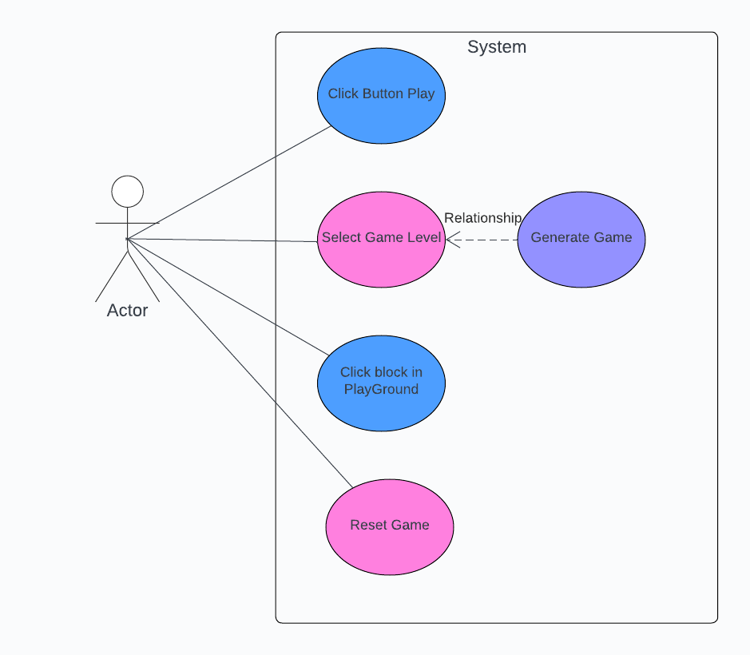

<h1 align="center">- ALGORITHM & DATA STRUCTURES COURSE PROJECT -
    MINESWEEPER GAME </h1>

## Introduction <a name="Introduction"></a> :bricks:

<div align="center">
 

</div>
<div style="text-align:justify">

This project developed an offline single-player version of the Minesweeper game. Players can enjoy the game without requiring an internet connection, leveraging algorithmic techniques and data structures to create an engaging gaming experience. It allows players to independently tackle different levels and challenge themselves in safely and swiftly uncovering all the mines on the board.
</div>

### Team Members :
| Order |         Name          |     ID      |                 Github account                  |
|:-----:|:---------------------:|:-----------:|:-----------------------------------------------:|
|   1   | Nguyễn Hoàng Gia Ân   | ITCSIU21161 | [annguyen0512](https://github.com/annguyen0512) |   
|   2   | Nguyễn Trọng Nguyên   | ITITIU21263 | [JetBlack219](https://github.com/JetBlack219)   |
|   3   | Võ Minh Khang         | ITCSIU21136 | [leaser019](https://github.com/leaser019)       |

### Installation :dart:

1. Java Runtime is needed.
2. Clone the repository.
  ```sh
   git clone https://github.com/leaser019/Minesweeper
   ```
3. Open Project Minsweeper in your IDE.
4. Run App Class.
5. Enjoy !
   

### Motivation :mechanical_arm:

<div style="text-align:justify">
Creating an offline Minesweeper game is driven by several motivations. It's an opportunity to apply algorithmic knowledge practically, enhance programming skills, and tackle challenges like grid management and user interactions. For developers passionate about game development, it's personally fulfilling. Additionally, it serves as a portfolio highlight, showcasing skills and creativity. Making an offline version also ensures accessibility for users without internet access. These reasons make developing a Minesweeper game a compelling and valuable project.
</div>

### Task Allocation :ok_man:

| Order | Task                                                                                          |  Assignee  | Contribution |
|:------|:----------------------------------------------------------------------------------------------|:----------:|:------------:|
| 1     | Coding UI/UX, Creating Graphic, Fixing Bugs, Write Report, Write README                       | Minh Khang |     33%      |
| 2     | Coding Game Logic, Solve Notification of the Game, Fixing Bugs, Draw UML, Make Slide          |Trong Nguyen|     33%      |
| 3     | Coding Game Interactive, Fixing Bugs, Present Game Idea, Make Report, Make Slide              |   Gia An   |     33%      |


<br />

## Techniques <a name="Techniques"></a>:joystick:
- Language: [Java](https://www.java.com/en/)
- Library: [Java Swing](https://docs.oracle.com/javase%2F7%2Fdocs%2Fapi%2F%2F/javax/swing/package-summary.html)

<br />


<!-- FEATURES -->

## Features <a name="Features"></a>:joystick:
### 1. Class Diagram
<div align="center">
    
</div>
<br />

### 2. User Case Diagram
<div align="center">
    
</div>
<br />

### 3. Activity Description

 #### Start Game
- User initiates the game.
- System initializes the game board.

 #### Game Loop
- Loop begins:
  - User selects a tile.
  - System reveals the selected tile:
    - If it's a mine, the game ends.
    - If it's empty, the system reveals adjacent tiles.
      - If adjacent tiles have mines nearby, display the count.
      - If adjacent tiles are also empty, repeat the process for those tiles.
  - Check for win condition:
    - If all non-mine tiles are revealed, the game is won.
  - User may flag potential mines.

#### Game End
- If a mine is revealed:
  - Game over, display mine locations.
  - Allow user to restart.
- If all non-mine tiles are revealed:
  - Game won, display a victory message.
  - Allow user to restart.

#### Restart or Exit
- User decides whether to restart the game or exit.

<!-- CHALLENGES -->

## Challenges<a name="Challenges">:bangbang:

- Task allocation for each team member
- Time management
- Using platform for communication (Drive, Trello)
- Working environment (Github)
  <br />


